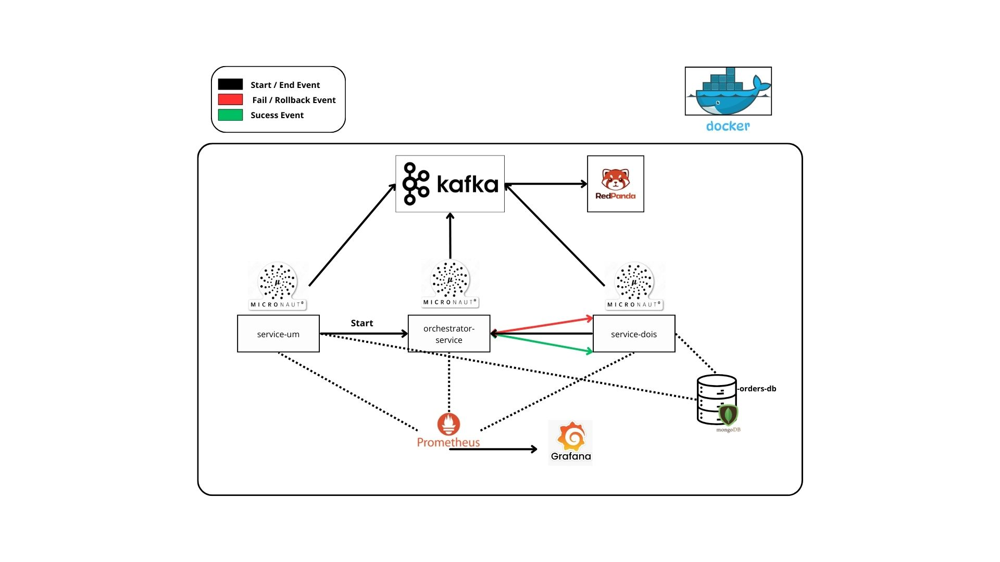

## 📖 Introdução

Este projeto explora a arquitetura de **microserviços** através de uma API REST desenvolvida em **Java** com o framework **Micronaut**. Ele simula um sistema de pedidos e pagamentos, onde diferentes serviços se comunicam de maneira **assíncrona** utilizando o **Apache Kafka**, um sistema de streaming de eventos. Isso permite que os serviços troquem mensagens de forma eficiente, sem a necessidade de conhecerem diretamente uns aos outros.

As aplicações são **containerizadas** com **Docker**, o que garante ambientes isolados e consistentes, facilitando a implantação e escalabilidade dos microserviços. Para monitoramento em tempo real, utilizamos uma combinação poderosa de ferramentas:

- **Micrometer** para coleta de métricas diretamente integradas no Micronaut.
- **Prometheus** para armazenar e consultar essas métricas.
- **Grafana** para visualização de dados em **dashboards interativos** e acompanhamento de desempenho do sistema.

## 🛠️ Tecnologias Utilizadas

- **Java 21**: Nova versão do Java, trazendo melhorias de performance e novos recursos.
- **Micronaut**: Framework rápido e leve, ideal para microserviços escaláveis.
- **Docker**: Containerização que facilita a escalabilidade e consistência dos ambientes.
- **Apache Kafka**: Sistema de mensageria para comunicação assíncrona entre os serviços.
- **Prometheus**: Plataforma de monitoramento de métricas em tempo real.
- **Grafana**: Ferramenta de dashboards para análise de dados e visualização de métricas.

## 📊 Diagrama de Arquitetura

A seguir está o diagrama que ilustra como os serviços interagem entre si no sistema de pedidos e pagamentos:

---

## 📚 Referências

- [Documentação Oficial do Micronaut](https://docs.micronaut.io/latest/guide/index.html)
