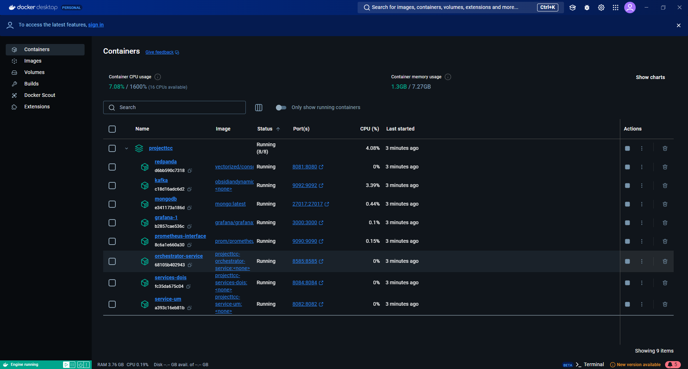

# APÊNDICE IV - TUTORIAL: UTORIAL BÁSICO DOCKER E DOCKERFILE: CRIANDO E EXECUTANDO IMAGEM DOCKER DE TODOS OS SERVIÇOS
## INTRODUÇÃO
O docker compose é uma ferramenta que é usada para definir e rodar aplicações que rodam em múltiplos container, como é o caso de aplicações de microsserviços. Neste tutorial apresentamos a configuração do docker-compose para definir e rodar os microsserviços usados como nosso exemplo de pedidos e pagamentos.

## COMO CRIAR CONTAINERS COM DOCKER-COMPOSE E BAIXAR AS IMAGES:
Crie um arquivo **docker-compose.yaml** na pasta raiz do projeto.

    Project/
    │
    ├── orquestrator-service/
    ├── service-um/
    ├── service-dois/
    ├── .gitignore
    ├── docker-compose.yaml
    ├── README.md

Abra o **docker-compose.yaml** adicione uma versão, que pode ser a versão mais recente, adicione também a tag de serviços que é dentro dela que vão ser criadas as images.
Exemplo:
````yaml
version: “3.8”
services:
````

Também dentro de services: pode se adicionar as images dos bancos de dados que deseja utilizar como o **MongoDB e/ou PostgreSQL**, passando as seguintes tags de configurações como exemplo:

PARA O BANCO DE DADOS **MONGODB**:
````yaml
nome-do-container:
    image: mongo:latest 
    container_name: nome-do-container
    restart: always
    ports:
        - “27017:27017” 
````
> image docker disponível no: **[Link Oficial](https://hub.docker.com)**.

> Essas `ports` servem para permitir a comunicação do container com o ambiente externo, a primeira porta é do host e a segunda porta é do container.

PARA O BANCO DE DADOS **POSTGRESQL**:
````yaml
nome-do-container:
  image: postgres:16
  environment:
  POSTGRES_DB: nome-do-banco-definido-no-pgadmin
  POSTGRES_USER: postgres
  POSTGRES_PASSWORD: postgres

  ports:
    - "5432:5432"
````
> image docker disponível no: **[Link Oficial](https://hub.docker.com)**.

> ``POSTGRES_USER:`` e `POSTGRES_PASSWORD:` são as mesmas que são definidas na criação do banco no Pgadmin!

Dentro de services: pode se adicionar as images dos micro serviços que deseja utilizar, e que deseja subir no docker, passando as seguintes tags de configurações como exemplo:


PARA MICRO SERVIÇOS INTEGRADOS AO **POSTGRESQL**:
````yaml
nome-do-container:
  build: './caminho-do-micro-serviço'
  container_name: nome-do-container
  depends_on:  
    - nome-do-container-do-banco-de-dados
  environment:
    DATASOURCES_DEFAULT_URL: jdbc:postgresql://nome-do-container-do-banco-de-dados:5432/nome-do-banco-de-dados
    DATASOURCES_DEFAULT_USERNAME: postgres
    DATASOURCES_DEFAULT_PASSWORD: postgres
  ports:
    - "8080:8080" 
````
> `DATASOURCES_DEFAULT_USERNAME` e `DATASOURCES_DEFAULT_PASSWORD` são as mesmas que são definidas na criação do banco no Pgadmin!

> `depends_on` Depende do container do banco de dados para iniciar, ou seja, usando postgreSQL ele vai depender do inicio do container postgres que foi criado anteriomente.

PARA MICRO SERVIÇOS INTEGRADOS AO **MONGODB**:
````yaml
nome-do-container:
  build: './caminho-do-micro-serviço'
  container_name: nome-do-container
  depends_on: 
    - nome-do-container-do-banco-de-dados
  environment:
    - MONGODB_URI= mongodb://nome-do-container-do-banco-de-dados:27017/nome-do-banco

  ports:
    - "8080:8080" 
````
## COMO CRIAR ARQUIVO DOCKERFILE:

O arquivo dockerfile é um script que serve para criar a imagem docker. Ele deve ser criado na raiz de cada um dos micro serviços.
Exemplo: nome-do-micro-serviço: clica com botão direito, New > File > digita Dockerfile

Dentro do Dockerfile, vai adicionar alguns scripts:
````dockerfile
FROM openjdk:21 
COPY target/nome-do-jar.jar app.jar 
EXPOSE 8080 
ENTRYPOINT ["java", "-jar", "app.jar"]
````
>  ``FROM openjdk:21 `` define qual image do jdk que vai usar, importante usar a mesma versão do java do projeto.

> ``COPY target/nome-do-jar.jar app.jar `` é aqui onde vai ser adicionado o nome do .jar do projeto que está nos arquivos temporarios **target/nome-do-jar-0.1.jar**.

> ``EXPOSE 8080 `` porta que vai ser exposta, deve ser a mesma definida no resources/application.properties/yaml.

## COMO CRIAR CONTAINERS DO KAFKA E REDPANDA NO DOCKER:

Vai na raiz do projeto e procure por docker-compose.yaml

Neste arquivo **YAML** temos as configurações de todos os containers que farão parte da aplicação.

Temos que permitir que todas as redes se comuniquem entre si, então adicionamos a configuração abaixo no docker-compose
````yaml
networks:
  orchestrator-service:
    driver: bridge
````

Além disso, adicionamos a configuração da rede em todas as configurações de todos os containers, sem exceção, para permitir a comunicação entre eles:
````yaml
networks:
  - orchestrator-service
````

Com isso já podemos configurar o kafka:
````yaml
kafka:
  container_name: kafka
  image: obsidiandynamics/kafka
  restart: "no"
  ports:
    - "9092:9092"
  networks:
    - orchestrator-service
  environment:
    KAFKA_LISTENERS: "INTERNAL://:29092,EXTERNAL://:9092" 
    KAFKA_ADVERTISED_LISTENERS: "INTERNAL://kafka:29092,EXTERNAL://localhost:9092" 
    KAFKA_LISTENER_SECURITY_PROTOCOL_MAP: "INTERNAL:PLAINTEXT,EXTERNAL:PLAINTEXT" 
    KAFKA_INTER_BROKER_LISTENER_NAME: "INTERNAL"
    KAFKA_RESTART_ATTEMPTS: "10" 
    KAFKA_RESTART_DELAY: "5"
  volumes: 
    - ./data/kafka/data:/var/lib/kafka/data
````
> ``KAFKA_LISTENERS: "INTERNAL://:29092,EXTERNAL://:9092"`` Define dois listeners: um interno na porta 29092 e um externo na porta 9092. O listener interno será usado para comunicação entre contêineres, e o externo para comunicação com serviços fora do ambiente Docker.

> `KAFKA_ADVERTISED_LISTENERS: "INTERNAL://kafka:29092,EXTERNAL://localhost:9092"` Define os listeners anunciados pelo Kafka, o que significa que quando um cliente se conecta ao Kafka, o broker vai informar que ele pode ser acessado internamente (dentro do Docker) via kafka:29092, ou externamente (fora do Docker) via localhost:9092.

> `KAFKA_LISTENER_SECURITY_PROTOCOL_MAP: "INTERNAL:PLAINTEXT,EXTERNAL:PLAINTEXT"` Define o protocolo de segurança para os listeners. Aqui, tanto o listener interno quanto o externo utilizam o protocolo PLAINTEXT, que não inclui autenticação ou criptografia (útil para desenvolvimento ou ambientes sem segurança crítica).

> ``KAFKA_INTER_BROKER_LISTENER_NAME: "INTERNAL"`` Informa ao Kafka que os brokers vão se comunicar entre si usando o listener interno configurado (porta 29092).

>`KAFKA_RESTART_ATTEMPTS: "10"` Define que o Kafka deve tentar reiniciar até 10 vezes em caso de falha.

>`KAFKA_RESTART_DELAY:` "5" Define um intervalo de 5 segundos entre cada tentativa de reinicialização, caso o Kafka falhe.

Agora vamos criar o container do RedPanda que vai servir para publicar e visualizar eventos do kafka:
````yaml
redpanda-console:
  container_name: redpanda-console
  image: docker.redpanda.com/vectorized/console:latest
  restart: on-failure
  entrypoint: /bin/sh
  command: -c "echo \"$$CONSOLE_CONFIG_FILE\" > /tmp/config.yml; /app/console"
  ports:
    - "8081:8080"

  networks:
    - orchestrator-service
  environment:
    CONFIG_FILEPATH: /tmp/config.yml CONSOLE_CONFIG_FILE: |
      kafka:
        brokers: ["kafka:29092"]
  depends_on:
    - "kafka"
````
> ``entrypoint: /bin/sh`` Define o comando inicial (/bin/sh) que será executado no contêiner ao iniciar.

>  ``command: -c "echo \"$$CONSOLE_CONFIG_FILE\" > /tmp/config.yml; /app/console"``
> 
> Esse comando realiza dois passos:
> 1. Escreve o conteúdo da variável de ambiente CONSOLE_CONFIG_FILE em um arquivo temporário chamado /tmp/config.yml.
> 2. Executa o aplicativo Redpanda Console com o comando /app/console.
Basicamente, isso cria dinamicamente o arquivo de configuração necessário para o Redpanda Console com base nas variáveis de ambiente e depois inicia a interface.

> ``ports``
Define o mapeamento de portas entre o host e o contêiner:
>"8081:8080" mapeia a porta 8080 (onde o Redpanda Console opera dentro do contêiner) para a porta 8081 no host, permitindo acesso via navegador em localhost:8081.

> ``CONFIG_FILEPATH: /tmp/config.yml`` Define o caminho do arquivo de configuração que será utilizado pelo Redpanda Console. Esse caminho corresponde ao arquivo temporário gerado pelo comando anterior.

> ``CONSOLE_CONFIG_FILE: |`` Essa variável contém o conteúdo do arquivo de configuração em YAML, que será gravado no arquivo temporário /tmp/config.yml. O conteúdo da configuração é:
> `kafka: brokers: ["kafka:29092"]` Isso informa ao Redpanda Console que ele deve se conectar ao broker Kafka rodando no contêiner kafka na porta 29092 (listener interno).

Sendo assim a porta que essa interface vai rodar vai ser a que foi definida em ports, no caso http://localhost:8081/

Agora é só conectar o banco de dados aos containers dos microsserviços e adicionar a rede e a porta do kafka:
````yaml
service-um:
  build: './service-um'
  container_name: service-um
  depends_on:
    - kafka
    - mongo
  networks:
    - orchestrator-service
  environment:
    - KAFKA_BOOTSTRAP_SERVERS= kafka:29092
    - MONGODB_URI= mongodb://mongo:27017/orders-db
  ports:
    - "8083:8083"

services-dois:
  build: './services-dois'
  container_name: services-dois
  depends_on:
  - mongo
  - kafka
  networks:
    - orchestrator-service
  environment:
    - KAFKA_BOOTSTRAP_SERVERS=kafka:29092
    - MONGODB_URI= mongodb://mongo:27017/orders-db
  ports:
    - "8084:8084"

orchestrator-service:
  build: './orchestrator-service'
  container_name: orchestrator-service
  depends_on:
    - kafka
  networks:
    - orchestrator-service
  environment:
    KAFKA_BOOTSTRAP_SERVERS: kafka:29092
  ports:
    - “4000:4000”
````
## CRIAÇÃO DO CONTAINER DO PROMETHEUS E GRAFANA:

Assim já podemos iniciar ele no docker usando as configurações anteriores:
````yaml
prometheus:
  image: prom/prometheus:latest
  container_name: prometheus
  volumes:
    - ./config/prometheus.yml:/etc/prometheus/prometheus.yml

  networks:
    - orchestrator-service
  ports:
    - "9090:9090"
````
> .`/config/prometheus.yml:/etc/prometheus/prometheus.yml` O primeiro é apontado o pacote das configurações do prometheus e depois as configurações dele no docker mas não se preocupe, isso é uma configuração padrão.

Depois que os containers estiver em pé é só pesquisar por localhost:9090, ou a porta que foi definida, ir em status e verificar se o state estar “UP”

Assim ele já está pronto e agora podemos conectar o Prometheus ao Grafana que é um serviço Web que oferece vários tipos de dashboards para analisar da melhor forma os gráficos com os dados coletados pelo Prometheus, então no docker-compose:
````yaml
grafana:
  image: grafana/grafana:latest
  ports:
    - "3000:3000"
  networks:
    - orchestrator-service
````


## COMO INICIAR TODOS OS CONTAINERS:

Abra o docker desktop, caso não tenha, **[link para download](https://www.docker.com/products/docker-desktop)**. 

Para iniciar o serviço de docker, no Prompt de comando: clique na pasta raiz do projeto, abra o terminal CMD digite docker ps que serve para ver os containers que estão rodando, se não der erro está ok.

````shell
docker ps
````
Primeiro deve atualizar a versão dos .jar dos microsserviços, abrindo o terminal CMD e navegando até a pasta do micro serviço: cd .\nome-do-micro-serviço\ 
````shell
cd .\nome-micro-servico\
````
dentro dela digite **mvn clean package** esse comando vai empacotar todo o micro serviço e criar o .jar, quando finalizar com Build Success, é só criar o contêiner com esse comando: docker build -t nome-do-container . 


Faça isso para todos os micro serviços.
````shell
mvn clean package
````
````shell
docker build -t nome-do-container . 
````
Por fim, na pasta raiz dos projetos onde contém todos os micro serviços digite docker-compose up --build -d comando que serve para baixar e iniciar as images de todos os micro serviços que foram criados dentro do docker-compose.yaml.
````shell
docker-compose up --build -d
````
Com isso, os container vão aparecer rodando dentro do Docker Desktop ou no terminal após digitar o comando docker ps.

