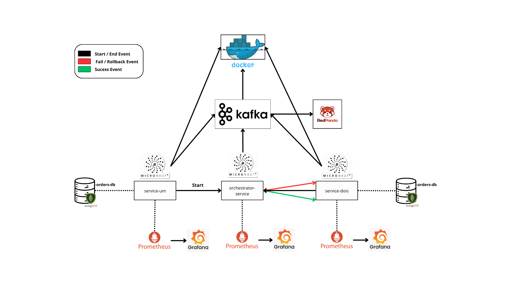

## 📖 Introdução

Este projeto explora a arquitetura de **microserviços** através de uma API REST desenvolvida em **Java** com o framework **Micronaut**. Ele simula um sistema de pedidos e pagamentos, onde diferentes serviços se comunicam de maneira **assíncrona** utilizando o **Apache Kafka**, um sistema de streaming de eventos. Isso permite que os serviços troquem mensagens de forma eficiente, sem a necessidade de conhecerem diretamente uns aos outros.

As aplicações são **containerizadas** com **Docker**, o que garante ambientes isolados e consistentes, facilitando a implantação e escalabilidade dos microserviços. Para monitoramento em tempo real, utilizamos uma combinação poderosa de ferramentas:

- **Micrometer** para coleta de métricas diretamente integradas no Micronaut.
- **Prometheus** para armazenar e consultar essas métricas.
- **Grafana** para visualização de dados em **dashboards interativos** e acompanhamento de desempenho do sistema.
## SUMÁRIO
Segue a sequência dos passos que devem ser seguidos nas branchers:
1. master
2. feature/service-um
3. feature/orchestrator-service
4. feature/micrometer
5. feature/docker
## 🛠️ Tecnologias Utilizadas

- **Java 21**: Nova versão do Java, trazendo melhorias de performance e novos recursos.
- **Micronaut**: Framework rápido e leve, ideal para microserviços escaláveis.
- **Docker**: Containerização que facilita a escalabilidade e consistência dos ambientes.
- **Apache Kafka**: Sistema de mensageria para comunicação assíncrona entre os serviços.
- **Prometheus**: Plataforma de monitoramento de métricas em tempo real.
- **Grafana**: Ferramenta de dashboards para análise de dados e visualização de métricas.

## 📊 Diagrama de Arquitetura

A seguir está o diagrama que ilustra como os serviços interagem entre si no sistema de pedidos e pagamentos:

## 🚀 Como Criar um Microserviço com Micronaut

### Pré-requisitos

Este guia assume que você já possui experiência com **Spring Boot** e desenvolvimento back-end.

### Passo a Passo

1. Acesse o site oficial do **[Micronaut Launch](https://micronaut.io/launch)**.
2. No formulário, configure as opções:
    - Linguagem: **Java**
    - Versão: Selecione a mais recente
    - Nome do Projeto: Defina o nome para seu projeto
    - Nome do Pacote: Defina o nome do pacote base
    - Ferramenta de build: Escolha entre **Gradle** ou **Maven**
    - Estrutura de teste: **JUnit**
3. Adicione as **features** desejadas (dependências como Kafka, JPA, etc.).
4. Clique em **Generate Project** para baixar o projeto em formato **.zip**.
5. Extraia o arquivo baixado:
    - **Atenção**: Cuidado para não arrastar pastas duplicadas (`service-um > service-um`).
6. Abra o projeto em sua IDE preferida.
7. Carregue as dependências do projeto (ao abrir na IDE, clique em "Load" se solicitado).

Agora, você está pronto para começar a desenvolver o seu microserviço com **Micronaut**!

---

## 📚 Referências

- [Documentação Oficial do Micronaut](https://docs.micronaut.io/latest/guide/index.html)
